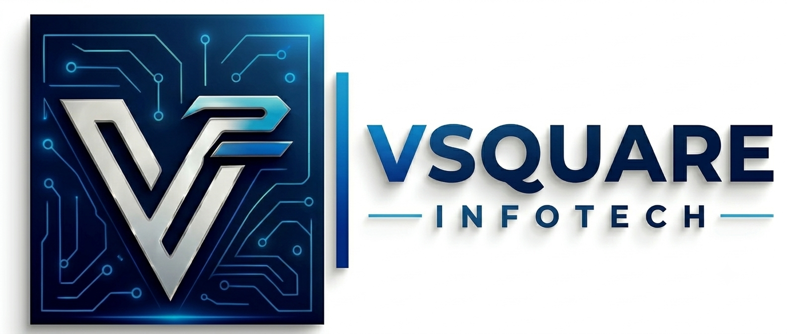

<p align="center">
  
</p>

<h1 align="center">VSQUARE INFOTECH</h1>

<p align="center">
  <strong>Engineering Scalable Software, Cloud Architectures & AI-Accelerated Solutions</strong>
</p>

<p align="center">
  <a href="https://github.com/vaishakhsz/vsquare-infotech"></a>
  <a href="LICENSE"></a>
  <a href="https://github.com/vaishakhsz/vsquare-infotech"></a>
</p>

---

## 🏢 About VSQUARE INFOTECH

**VSQUARE INFOTECH** is a modern technology company dedicated to engineering reliable, enterprise-grade digital systems. We empower startups, growing businesses, educational institutions, and enterprises by building scalable digital products from conceptual architecture to long-term corporate deployment.

Our engineering methodologies integrate cutting-edge **AI foundation models** to accelerate code generation, automate testing, and deliver mission-critical software solutions faster with uncompromising quality.

---

## 🚀 Core Capabilities & Services

### 1. 💻 Custom Software Engineering
Tailor-made backend services, microservices, enterprise ERP/CRM tools, and scalable distributed systems architected for stability, high throughput, and high availability.

### 2. 🌐 Modern Web Applications
Ultra-responsive, high-performance web applications built with modern frontend frameworks, progressive web app (PWA) standards, and subpixel-accurate responsive design.

### 3. 📱 Mobile App Development
Feature-rich iOS and Android mobile solutions engineered for seamless user experiences, low-latency performance, and offline-first capabilities.

### 4. ☁️ Cloud Architecture & DevOps
Cloud-native infrastructure (AWS, Azure, Google Cloud), automated CI/CD pipelines, container orchestration (Docker, Kubernetes), and secure DevOps automation.

### 5. 🤖 AI-Accelerated Delivery
Leveraging state-of-the-art AI runtime models to fast-track software processing, optimize workflow pipelines, and reduce time-to-market without technical debt.

---

## 🌟 Why Choose Us?

| Feature | Advantage |
| :--- | :--- |
| **⚡ AI-Accelerated Delivery** | Faster development cycles powered by integrated intelligent engineering tools. |
| **🛡️ Enterprise Security** | Strict data governance, modern encryption protocols, and zero-trust foundations. |
| **📈 High Scalability** | Elastic architectures engineered to effortlessly support exponential user growth. |
| **🤝 Long-Term Support** | Ongoing operational maintenance, regular performance audits, and SLA-backed SLAs. |

---

## 👨‍💼 Leadership

<table align="center">
  <tr>
    <td align="center">
      <strong>Vaishakh Sivarajan</strong><br />
      <em>Founder & Managing Director</em><br />
      VSQUARE INFOTECH
    </td>
  </tr>
</table>

---

## 📍 Contact & Corporate Information

- **Corporate Office**: SARA-270, Amritha, Cherubalamandam Road, Vellayani, Nemom P.O, Trivandrum, Kerala, India
- **Direct Phone**: [+91 8547469165](tel:+918547469165)
- **Official Email**: [info@vsquareinfotech.co.in](mailto:info@vsquareinfotech.co.in)
- **Business Hours**: Monday – Friday | 8:00 AM – 7:00 PM IST
- **Google Maps**: [View Location](https://maps.app.goo.gl/pM4wdCoww8XmNiPr8)

---

## 💻 Local Preview & Development

This repository contains the complete self-contained production portal for VSQUARE INFOTECH.

### Quick Start
1. Clone the repository:
   ```bash
   git clone https://github.com/vaishakhsz/vsquare-infotech.git
   cd vsquare-infotech
   ```
2. Open in your browser:
   - Double-click `index.html`, or
   - Launch with Python:
     ```bash
     python -m http.server 3000
     ```
   - Navigate to `http://localhost:3000`

---

## 📄 License

Distributed under the **MIT License**. See [`LICENSE`](LICENSE) for more details.

<p align="center">
  &copy; 2026 <strong>VSQUARE INFOTECH</strong>. All Rights Reserved.
</p>
